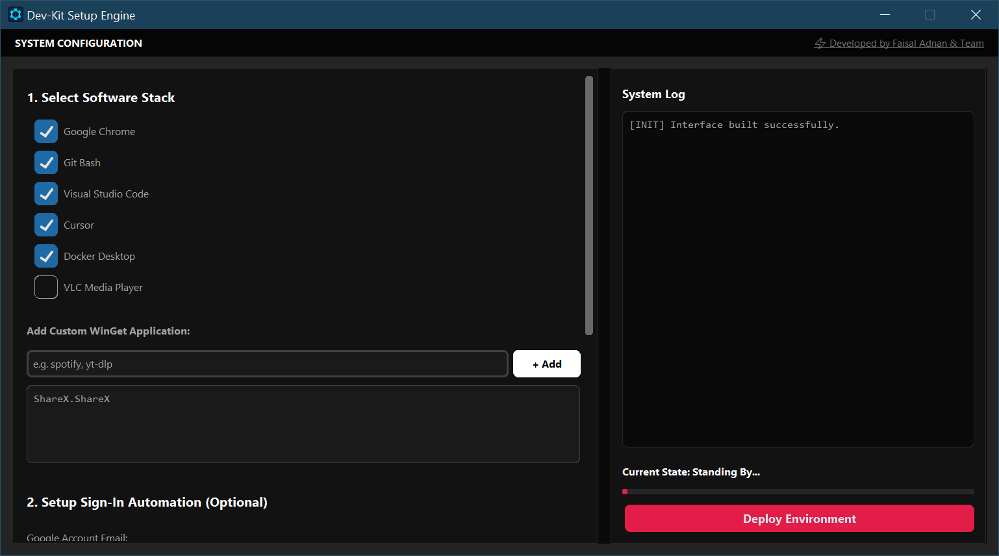
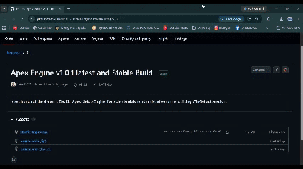

<div align="center">


# DevKit Engine — Apex

### One-click Windows dev environment setup. No manual installs. No wasted time.

[](https://opensource.org/licenses/MIT)
[](https://github.com/Faisal6951/DevKit-Engine/releases)
[](https://python.org)
[](https://learn.microsoft.com/en-us/windows/package-manager/)
[](https://github.com/Faisal6951/DevKit-Engine/releases)

<br/>

**Tired of setting up a new Windows machine from scratch?**
DevKit Engine automates the entire process — select your tools, hit Deploy, and walk away.
It installs everything silently using Windows' built-in WinGet. No browser tabs. No setup wizards. No bloatware.

<br/>

[⬇️ Download Apex.exe](https://github.com/Faisal6951/DevKit-Engine/releases) &nbsp;·&nbsp; [📺 Watch Demo](#-demo) &nbsp;·&nbsp; [🚀 Quick Start](#-getting-started)

</div>

---

## 📸 Preview

<div align="center">
  
</div>

---

## 🎬 Demo

<div align="center">
  
</div>

> 📺 **Full video demo coming soon** — [watch on GitHub Releases](https://github.com/Faisal6951/DevKit-Engine/releases)

---

## ❓ What Problem Does It Solve?

Setting up a fresh Windows machine as a developer means:

- Searching for every tool website manually
- Clicking through setup wizard after setup wizard
- Forgetting to install something and going back
- Logging into Chrome, Git, Docker — one by one

**DevKit Engine eliminates all of that in a single click.**

---

## ⚡ Key Features

- **Silent Auto-Install** — Downloads and installs tools in the background. No prompts, no clicking. Just done.
- **Smart Skip** — Already have a tool installed? DevKit Engine detects it and skips it automatically.
- **Official Sources Only** — Every tool is fetched directly via Windows WinGet from its official package. No third-party sites, no risk.
- **Auto Login Support** — Optionally enter credentials for Chrome, Docker, and Git Bash. The engine installs and logs you in automatically.
- **Zero Footprint** — Ships as a single portable `.exe`. No installation required. Run it from a USB drive if needed.
- **Fully Offline Credentials** — Login credentials never leave your machine. No telemetry. No cloud sync. No tracking.

---

## 🛠️ Integrated Tools

DevKit Engine comes pre-configured to install the following out of the box:

| Software | WinGet Package ID | Purpose |
| :--- | :--- | :--- |
| **Google Chrome** | `Google.Chrome` | Primary Web Browser |
| **Git Bash** | `Git.Git` | Version Control |
| **Visual Studio Code** | `Microsoft.VisualStudioCode` | Code Editor |
| **Cursor** | `Anysphere.Cursor` | AI-First IDE |
| **Docker Desktop** | `Docker.DockerDesktop` | Containerization |
| **VLC Media Player** | `VideoLAN.VLC` | Media Player |
| **Firefox** | `Mozilla.Firefox` | Web Browser |
| **Brave** | `Brave.Brave` | Privacy Browser |

> You can select only the tools you need. Anything already installed gets skipped automatically.

---

## 🚀 Getting Started

### Prerequisites

- Windows 10 or Windows 11
- Administrator privileges (required for silent WinGet installs)

### Installation

1. Go to the [**Releases page**](https://github.com/Faisal6951/DevKit-Engine/releases)
2. Download **`Apex.exe`**
3. Right-click → **Run as Administrator**
4. Select the tools you want
5. Optionally fill in credentials for auto-login
6. Hit **Deploy** — DevKit Engine handles everything from here

That's it.

---

## 🔐 Optional Auto Login

DevKit Engine includes optional credential fields for:

- **Google Chrome** — logs into your Google account after install
- **Docker Desktop** — authenticates Docker Hub automatically
- **Git Bash** — configures your Git identity and credentials

If you skip these fields, the tools still install — you just log in manually as normal. Credentials are stored locally only and never transmitted anywhere.

---

## 💻 Tech Stack

| Layer | Technology |
| :--- | :--- |
| **Language** | Python 3.12 |
| **UI Framework** | CustomTkinter |
| **Install Engine** | Windows WinGet via `subprocess` |
| **Architecture** | MVC (Model-View-Controller) |
| **CI/CD** | GitHub Actions |
| **Packaging** | PyInstaller → standalone `.exe` |

---

## 📁 Project Structure

```
DevKit-Engine/
├── main.py              # Entry point
├── config.py            # Central configuration
├── ui/                  # UI components (CustomTkinter)
├── logic/               # Install & automation logic
├── assets/              # Icons and images
└── .github/workflows/   # CI/CD pipeline
```

---

## 🔒 Privacy & Security

DevKit Engine operates **entirely locally**.

- Does **not** collect telemetry or usage data
- Does **not** transmit credentials to any server
- Does **not** modify system files outside of WinGet install routines
- All credential fields are stored in a local configuration only

See [PRIVACY.md](PRIVACY.md) for full details.

---

## 📄 License

Distributed under the **MIT License** — see [LICENSE](LICENSE) for details.

---

<div align="center">

Built by [Faisal](https://github.com/Faisal6951) &nbsp;·&nbsp; If this saved you time, drop a ⭐ on the repo

</div>