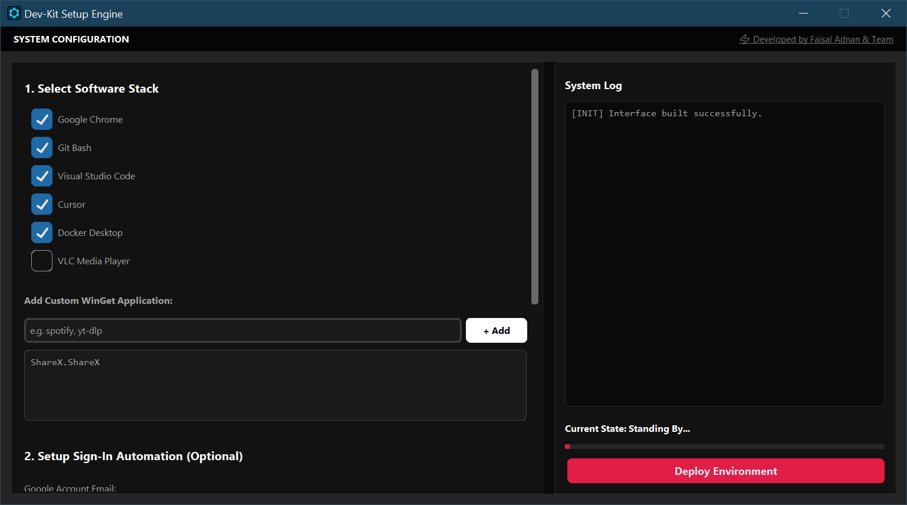

<div align="center">


# DevKit Engine — Apex

### One-click Windows developer setup. Official WinGet packages. Zero telemetry.

[](https://opensource.org/licenses/MIT)
[](https://github.com/Faisal6951/DevKit-Engine/releases)
[](https://python.org)
[](https://learn.microsoft.com/en-us/windows/package-manager/)
[](https://github.com/Faisal6951/DevKit-Engine/releases)

**New machine. Empty disk. Two minutes of clicking instead of two hours of installers.**

Select a stack, optionally drop in credentials, hit Deploy. DevKit Engine silently installs from official WinGet sources, skips what you already have, and keeps secrets on this PC.

[⬇️ Download the latest `.exe`](https://github.com/Faisal6951/DevKit-Engine/releases) &nbsp;·&nbsp; [📺 Demo](#-demo) &nbsp;·&nbsp; [🚀 Quick start](#-getting-started)

</div>

> **Windows SmartScreen** may warn because the release is not Authenticode-signed yet. Choose **More info → Run anyway**. The source is public; nothing is hidden.

---

## Preview

<div align="center">
  
</div>

---

## Demo

<div align="center">
  
</div>

---

## What it actually does

A fresh Windows box usually means hunting download pages, babysitting wizards, and rediscovering the one tool you forgot. DevKit Engine collapses that into a single local session:

1. Preflight — admin, WinGet, network
2. Index — one WinGet + registry scan, so already-installed apps are skipped
3. Plan — you see install vs skip before anything runs
4. Deploy — silent official packages, then optional Git / Docker / Chrome sign-in
5. Report — counts, failures, elapsed time, and a local completion page

Credentials never leave the machine. Tokens and passwords are sealed with Windows DPAPI in `devkit_vault.json`.

---

## Features

- **Silent installs** from WinGet — no third-party mirrors, no extra wizards
- **Smart skip** — installed software is detected once and left alone
- **Presets** — Recommended, Full stack, Browsers, or your own mix
- **Custom packages** — search by name or paste a WinGet ID; remove anytime
- **Optional sign-in** — Git identity + stored GitHub token, Docker Hub login, Chrome account hint
- **Portable** — one `.exe`, USB-friendly, no installer
- **Honest status** — success is success; failures are listed, not papered over
- **Cancel-safe** — stop after the current package without killing the machine state
- **Local-only vault** — no accounts, no cloud, no telemetry

---

## Bundled catalog

| Software | WinGet ID | Role |
| :--- | :--- | :--- |
| Google Chrome | `Google.Chrome` | Browser |
| Mozilla Firefox | `Mozilla.Firefox` | Browser |
| Brave | `Brave.Brave` | Privacy browser |
| Git Bash | `Git.Git` | Version control |
| Visual Studio Code | `Microsoft.VisualStudioCode` | Editor |
| Cursor | `Anysphere.Cursor` | AI-first IDE |
| Docker Desktop | `Docker.DockerDesktop` | Containers |
| VLC Media Player | `VideoLAN.VLC` | Media |

Anything already present is skipped. Custom WinGet IDs sit alongside this list.

---

## Getting started

**Needs:** Windows 10 or 11, Administrator (WinGet silent installs), internet.

1. Download **`DevKit-Engine.exe`** from [Releases](https://github.com/Faisal6951/DevKit-Engine/releases)
2. Right-click → **Run as administrator** (the engine also requests elevation)
3. Pick a preset or tick the tools you want
4. Optionally fill Git / Docker / Google fields
5. Click **Deploy environment** (or `Ctrl+Enter`)

Walk away. The log and completion page tell you what landed, what was already there, and what failed.

---

## Optional auto login

| Field | What happens |
| :--- | :--- |
| Google email | Opens Chrome on the Google sign-in page with that account hinted |
| GitHub username + token | Sets `git` identity and stores the GitHub credential locally |
| Docker Hub user + password | Waits for the engine, then `docker login` on this machine |

Leave them blank and the apps still install — you sign in yourself later.

---

## Run from source

```powershell
python -m venv .venv
.\.venv\Scripts\activate
pip install -r requirements.txt
python main.py
```

---

## Tech

| Layer | Choice |
| :--- | :--- |
| Language | Python 3.12 |
| UI | CustomTkinter |
| Installer | Windows WinGet |
| Secrets | Windows DPAPI (local vault) |
| Packaging | PyInstaller → one `.exe` |
| CI | GitHub Actions |

```
DevKit-Engine/
├── main.py              # Elevation, DPI, launch
├── config.py            # Catalog, presets, theme
├── ui/launcher_ui.py    # Desktop experience
├── logic/               # WinGet, vault, auth, deploy
├── assets/              # Icon and media
└── .github/workflows/   # Release build
```

---

## Privacy

Entirely local. No telemetry. No credential upload. See [PRIVACY.md](PRIVACY.md).

---

## License

MIT — [LICENSE](LICENSE)

<div align="center">

Built by [Faisal](https://github.com/Faisal6951) · If this saved you an afternoon, star the repo

</div>
